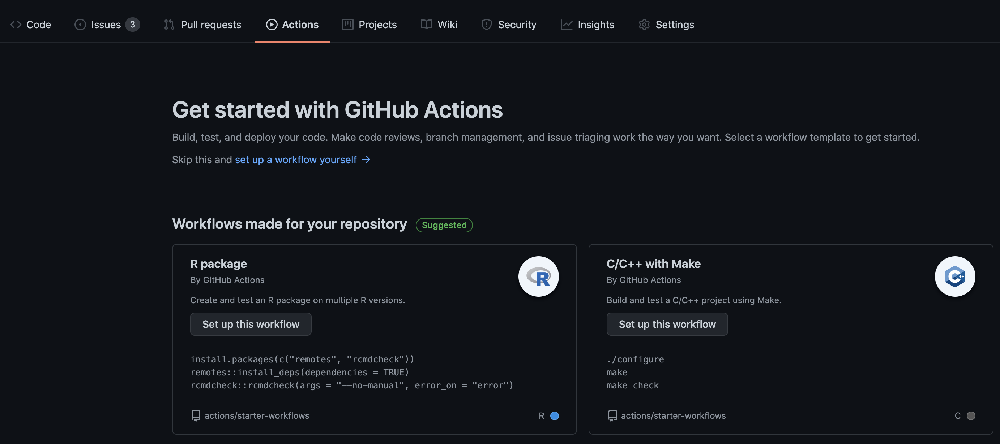
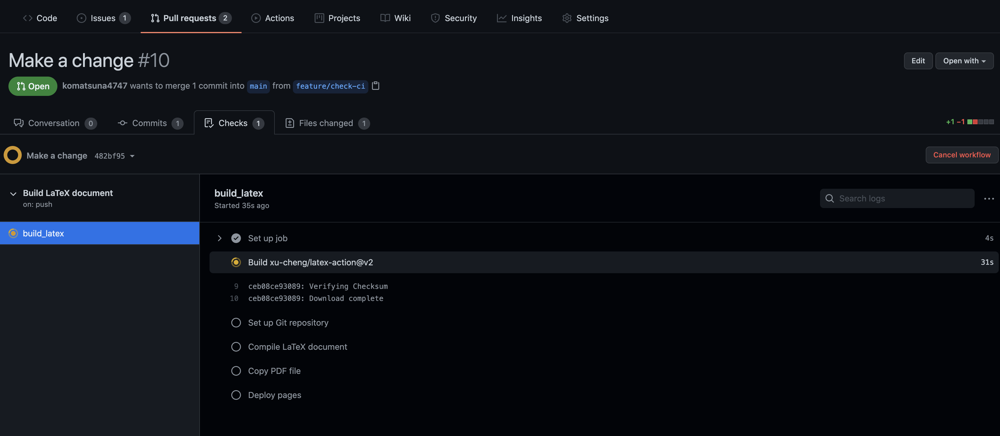
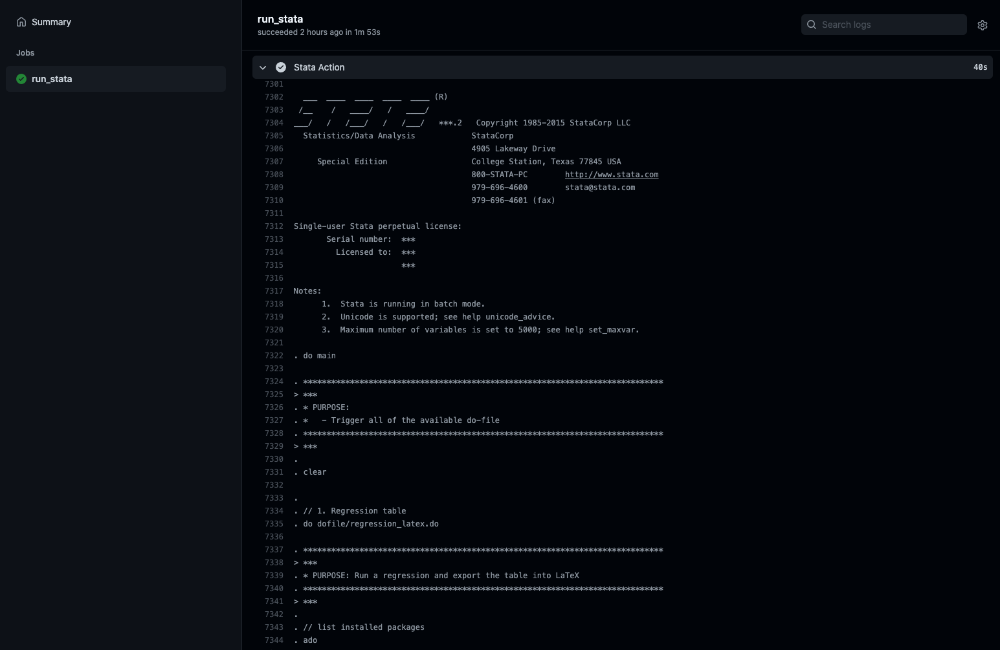

# 継続的インテグレーションで、ワークフローを自動化する

Git/GitHub の使い方に慣れ、共著者とコードの共有がスムーズにできるようになれば、それは大きな進歩である。
更新する毎にファイル名を変えたり、同じファイルをDropbox上で同時に編集しないように共著者同士で話し合ったり、そうした無駄を削減できるからだ。

しかし無駄を減らしていくと、もっと楽したいと思うのが人間の性である。
基本的なGit/GitHubのワークフローは、以下のようなものであると思う。

1. 各人のローカルで作業を行い
1. 各人のローカルでコードを走らせ
1. その結果をリモートである GitHub にプッシュし
1. pull request を通じてコミュニケーションを取る

このうち、「各人のローカルでコードを走らせ」と「その結果をリモートである GitHub にプッシュし」の部分を自動化して楽にしようというのが本章の内容である。

ローカルで手動で行っていたワークフローを自動化し、プログラムに変更があるたびに都度ビルド・テストをを行える環境を作ることを、**継続的インテグレーション (Continuous Integration: CI)** と呼ぶ。
それを可能にする機能の1つが、**GitHub Actions** である。GitHub Actions とは、開発者のワークフローを GitHub 上で自動化するためのツールである。

https://github.com/features/actions

ここでは、研究プロジェクトの遂行上で関連がありそうな、以下のユースケースを紹介したい。

- 論文・スライド用の tex ファイルを自動的にコンパイルし、最新版が常に見られるようにする
- 分析用のDo fileを修正したあとコードを回し、分析結果を自動的にアップデートする
- 作成している R のパッケージに修正を加え、単体テストを自動的に走らせる

## 論文・スライド用の tex ファイルを自動的にコンパイルし、最新版が常に見られるようにする

共著者の中には論文をチェックできれば良い人もいるため、そういう人にとっては `tex` ファイルをプルしてコンパイルする作業が面倒であったりする。
コンパイルできる人がローカルで pdf を作成し、それをリモートリポジトリにプッシュするのも良いだろうが、プッシュし忘れて、`tex` ファイルのバージョンと pdf ファイルのバージョンが食い違ったりすることもあり得る。
手作業による運用は往々にしてミスを生みがちなので、この辺を自動化したい。
つまり、 `tex` ファイルだけをプッシュすれば GitHub が勝手にコンパイルしてくれたりしないだろうか。

そこで、執筆者がローカルで tex file をコンパイルして pdf ファイルをアップロードする一連のワークフローを、GitHub Actions で自動化したい。
このように、

始め方は、リポジトリのルートディレクトリに `.github/workflow`というディレクトリを作り、その中に `yaml` ファイルを作成すればよい。
これは GitHub の Actions からも作成することも可能である。

```{r, echo=FALSE}

```


ひとまず `komatsuna4747/gitpractice/.github/workflow` に以下のような `main.yaml`を作成した。
今回のワークフローの自動化では、[こちら](https://github.com/xu-cheng/latex-action)を利用している^[本来は、ローカルで Docker を用いた LaTeX 環境と同じもので GitHub 上でもコンパイルできるようにした方が理想である]。

```{yaml, eval=FALSE}
# This is a basic workflow to help you get started with Actions
name: Build LaTeX document

# Controls when the workflow will run
on:
  push:
    paths:
    - 'papers/report.tex'

jobs:
  build_latex:
    runs-on: ubuntu-latest
    steps:
      - name: Set up Git repository
        uses: actions/checkout@v2
      - name: Compile LaTeX document
        uses: xu-cheng/latex-action@v2
        with:
          working_directory: papers
          root_file: report.tex
      - name: Copy PDF file
        run: mkdir docs && cp papers/*.pdf docs/
      - name: Deploy pages
        uses: peaceiris/actions-gh-pages@v3
        with:
          github_token: ${{ secrets.GITHUB_TOKEN }}
          publish_dir: ./docs
```


このファイルを容易することで、変更が加えられた tex ファイルが GitHub のリポジトリにプッシュされるごとに

- tex ファイルがコンパイルされて pdf が作成され
- 作成された pdf ファイルが `gh-pages` というブランチにプッシュされる

以上を自動的に行ってくれるようになる。したがって pdf ファイルだけを見たい人は、`gh-pages` の pdf をダウンロードして読めばよいことになる。
さらに、変更が加えられた tex ファイルがプッシュされるごとに、`gh-pages` の pdf も更新されるので、tex のファイルのバージョンと pdf のバージョンが常に最新版でリンクするようになるわけである。

実際にどのように動くのかを見てみよう。

まず、tex ファイルに以下のような変更を加えてコミットし、プッシュする。

```{diff}
$ git diff
diff --git a/papers/report.tex b/papers/report.tex
index 117cbb2..327440f 100644
--- a/papers/report.tex
+++ b/papers/report.tex
@@ -17,7 +17,7 @@
 
 \section{Introduction}
 
-\citet{knittel2018working} is a good reference for data management issues in empirical research projects.
+\citet{knittel2018working} is a good reference for empirical research projects.
 
 \bibliography{report}
 \bibliographystyle{aer}
```

```{shell}
$ git add -u

$ git status 
On branch feature/check-ci
Changes to be committed:
  (use "git restore --staged <file>..." to unstage)
        modified:   report.tex

$ git commit -m "Make a change"
[feature/check-ci 482bf95] Make a change
 1 file changed, 1 insertion(+), 1 deletion(-)

$ git status
On branch feature/check-ci
nothing to commit, working tree clean

$ git push origin HEAD
Enumerating objects: 7, done.
Counting objects: 100% (7/7), done.
Delta compression using up to 16 threads
Compressing objects: 100% (4/4), done.
Writing objects: 100% (4/4), 345 bytes | 345.00 KiB/s, done.
Total 4 (delta 3), reused 0 (delta 0)
remote: Resolving deltas: 100% (3/3), completed with 3 local objects.
remote: 
remote: Create a pull request for 'feature/check-ci' on GitHub by visiting:
remote:      https://github.com/komatsuna4747/gitpractice/pull/new/feature/check-ci
remote: 
To github.com:komatsuna4747/gitpractice.git
 * [new branch]      HEAD -> feature/check-ci
```

変更が加えられた tex ファイルがプッシュされたので、以下のようにコンパイルをするための準備、およびコンパイルが始まった。

```{r, echo=FALSE}

```

しばらく待つと、全ての作業が完了した。どこかで失敗が起こった場合、登録したメールアドレスの方に GitHub Actions のワークフローが失敗した通知が届く。

```{r, echo=FALSE}
knitr::include_graphics("images/actions-completed.png")
```

`gh-pages` ブランチの pdf ファイルを見ると、確かに変更が反映された pdf がアップロードされていることがわかる。

```{r, echo=FALSE}
knitr::include_graphics("images/paper-latest.png")
```

過去の pdf をみたい場合は、そのファイルの history からたどることができる。

tex のソースファイルを見たくない共著者にはこの pdf を共有して、コメントをもらえばよい。

このワークフローをよりカスタマイズしたい場合は、`.github/workflows` の yml ファイルを編集すればよい。
具体的には

- どのイベントをトリガーとするか (pull request か、push か、etc)
- 論文用・スライド用のtexファイルが別々にあるとき、片一方だけが更新されたときにそれだけをコンパイルする

など。

## 分析用のDo fileを修正したあとコードを回し、分析結果を自動的にアップデートする

GitHub Actions 上で Stata を走らせることができるパッケージが存在する (使うためにはStata を購入し、シリアルナンバーなどの情報が必要である)

https://github.com/ledwindra/continuous-integration-stata

筆者もこのパッケージを用いて遊んでみた。

https://github.com/komatsuna4747/ci-stata


```{r, echo=FALSE}

```


これでできることは

- 新たに作成した/修正を加えた Do file がエラーなく回るかを確認する
- Do file から作成した図表を保存し、
  - 新しい図表が作成されたとき、または図表に変更が加えれたときは、リモートの作業ブランチに自動的にコミットする
  - 作成された図表に変更がない場合は、何もコミットしない
  
こうすることで、

- 各共著者のローカル環境に依存しない分析ワークフローの構築
- 分析、図表アップデートの自動化

が達成できる。

現時点で、この運用における問題点は以下の通り (to be updated)

- GitHub Actions で分析コードを回す時、どのようにデータをダウンロードしてくるか
  - Dropbox の公開リンクを通じたダウンロードは、セキュリティ上望ましくない
  - GitHub に直接データを置くことも、基本的には避けたほうがよい (大容量データを GitHub では管理しないこと)
  -  Google Drive, S3 の API を活用すればうまくいきそう。Dropbox は不明。
- ワークフローを実行するためマシンのスペックが高くないので、計算負荷の高いコードは回さない方がよい
  - Linux 仮想マシンのハードウェア仕様は、2コアCPU、7 GBのRAMメモリー、14 GBのSSDディスク容量 ([source](https://docs.github.com/ja/actions/using-github-hosted-runners/about-github-hosted-runners)) とのこと
  - 簡単な回帰分析だけであれば試す価値は十分にある
  - GitHub Actionsを回すためのホストマシンは、自前で用意することも可能 (EC2インスタンスなど)。ここを整備すれば、全てのワークフローを自動化することも可能に思われる。


## 作成している R のパッケージに修正を加え、単体テストを自動的に走らせる

Rのパッケージを作成時に大事なのは、そのパッケージに問題がないかを定期的に確認することである。
具体的には、単体テストがエラーなく回るかどうかを日常的に確認する。
もし CRAN にパッケージをサブミットする場合は、`devtools::check()` で ERROR, WARNING が0である必要がある。

ただし、`devtools::check()` はパッケージが大きくなると実行に時間がかかったり、テストがパスするかどうかを確認するのを忘れてpull requestを投げてしまったりすることがある。
ダブルチェックもかねて、GitHub Actions にこのあたりの任せるのは良い一手である。

R と GitHub Actions の組み合わせでは、こちらを参考にするとよいだろう。

https://github.com/r-lib/actions

筆者も遊びで、自作パッケージに GitHub Actions を用いた CI パイプラインを作成してみた。

https://github.com/komatsuna4747/myergm


### 注意点

GitHub Actions は、

- パブリックリポジトリだと無料
- プライベートリポジトリだと、以下の無料枠を使い切ったあとは従量課金制である
  - Free アカウントだと 2000分/月まで無料
  - Pro アカウントだと 3000分/月まで無料
  
なので GitHub Actions の使い方を練習したい場合は、念の為パブリックリポジトリで行うほうが良いだろう。